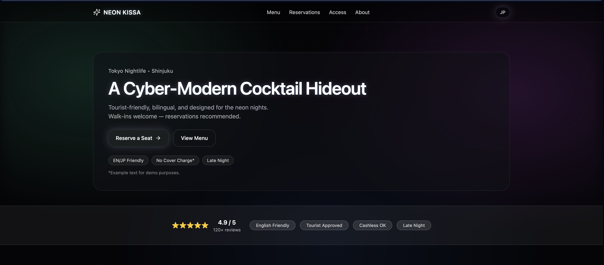
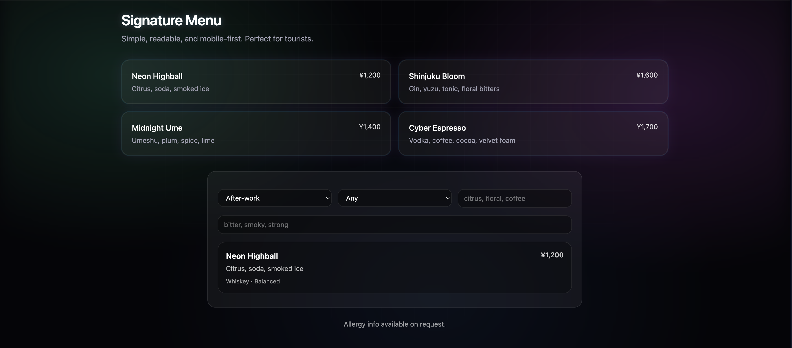
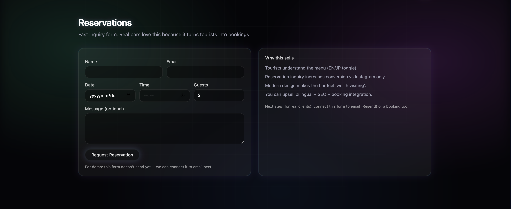
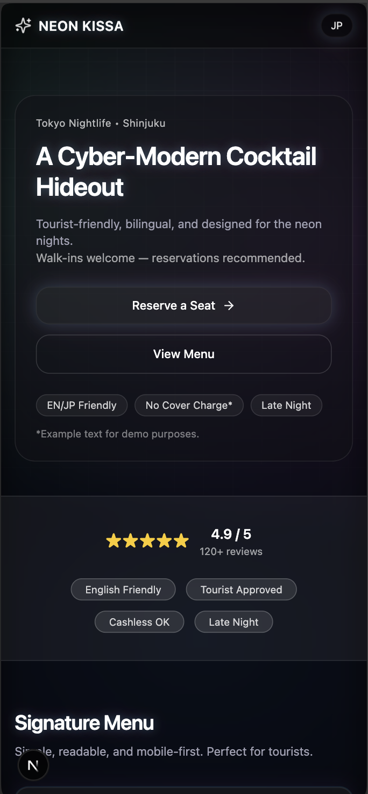

# Tokyo Neon Kissa

A bilingual cocktail bar concept website designed for Tokyo nightlife venues serving both local customers and international visitors.

This project demonstrates **full-stack web development**, combining a modern UI with a working reservation system and a cocktail recommendation feature.

---

## Live Demo

https://tokyo-neon-bar.vercel.app

---

## Screenshots

### Homepage

### Cocktail Finder

### Reservation Form

### Mobile Layout

---

## Features

### User Experience
- English / Japanese language toggle
- Modern minimalist cocktail bar UI
- Responsive layout for desktop and mobile
- Google Maps access section

### Cocktail Finder
- Interactive drink recommendation system
- Filters based on mood and sweetness
- Flavor preferences and exclusions
- Dynamic scoring logic for recommendations

### Reservation System
- Reservation request form
- Server-side API processing
- Email notifications for new reservations

---

## Backend Features

- API route for reservation handling
- Email delivery via **Resend**
- Environment variables for secure API keys
- Serverless deployment on **Vercel**

---

## Security / Hardening

The reservation system includes basic protections:

- Honeypot anti-spam field
- Rate limiting for reservation requests
- Input sanitization for safer email content
- Production sanity testing

---

## Tech Stack

### Frontend
- Next.js
- React
- TypeScript
- Tailwind CSS

### Backend
- Next.js API Routes
- Resend Email API

### Infrastructure
- Vercel Deployment
- Environment Variables

---

## Challenges

### Building a Recommendation System
The Cocktail Finder required designing a scoring system that evaluates user preferences such as mood, sweetness, and flavor keywords.

### Bilingual UI Design
Supporting both English and Japanese required careful UI design to maintain readability and layout balance across languages.

### Reservation Workflow
Creating a working reservation system required connecting a frontend form with a backend API route and email delivery service.

---

## What I Learned

Through this project I practiced:

- Designing realistic UI for hospitality businesses
- Implementing server-side API routes
- Handling environment variables in production
- Deploying full-stack applications
- Integrating third-party APIs

---

## Project Purpose

This project was built as a **portfolio demonstration of full-stack web development** using modern JavaScript tools.

The concept focuses on nightlife venues in Tokyo that want to serve both local and international customers.

---

## Status

Deployed and fully functional.

---

## Author

Batmagnai Ganbaatar
